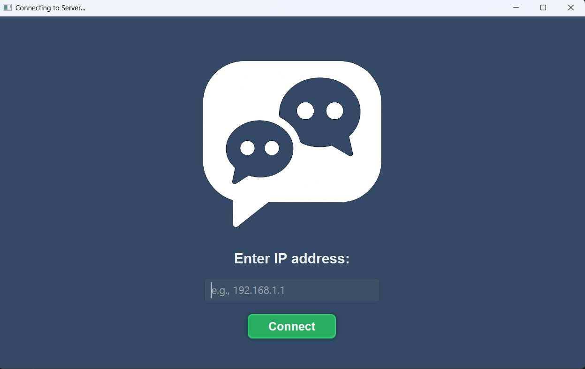
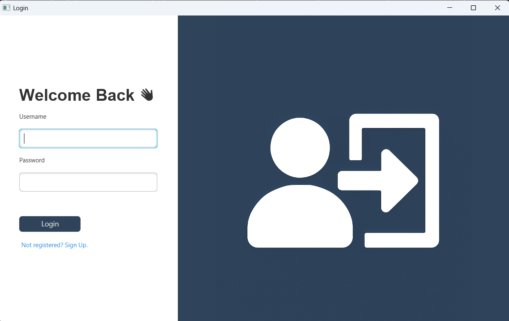
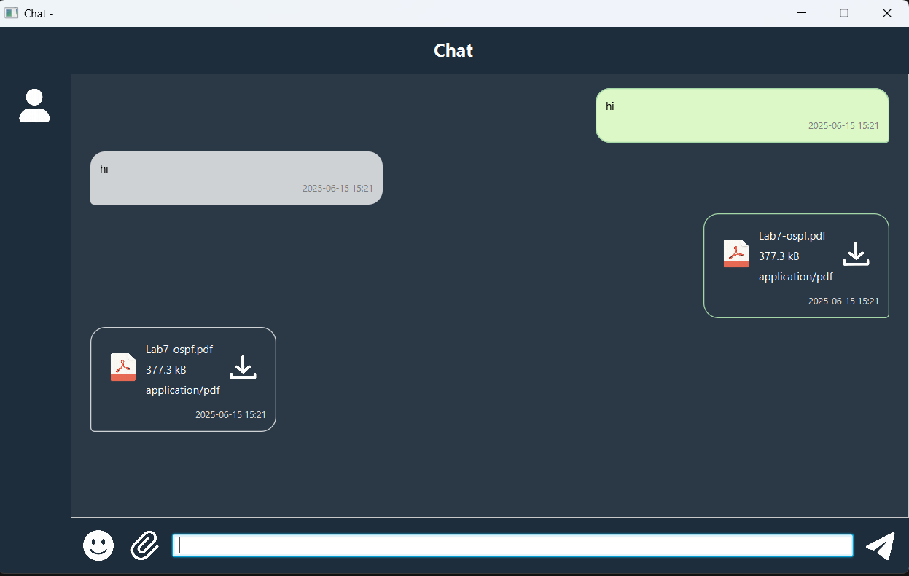

# 💬 JavaFX P2P Chat App with RPC

A peer-to-peer (P2P) messaging application built with Java and JavaFX. It allows two users on the same network to connect directly, chat in real-time, and share files without a centralized server.

---

## ✨ Features

- 🔐 Login and Sign-Up page UI (mocked, not connected to DB)
- 🌐 Direct IP address connection (P2P)
- 💬 Full-duplex real-time text messaging
- 📁 File transfer support (via socket streams)
- 🖼️ JavaFX GUI with styled layout and images
- 🧵 Threaded listening for incoming messages and files

---

## 📸 Screenshots

*(Optional: Add actual screenshots in `/screenshots/` and update the links below)*

| IP Entry | Login Page| Sign Up Page | Chat Interface |
|----------|-----------|--------------|----------------|
|  |  |  |

---

## 🚀 Getting Started

### 📦 Prerequisites

- Java 17+
- JavaFX SDK (download from [https://openjfx.io](https://openjfx.io))
- Java IDE (Eclipse, IntelliJ, or VS Code with JavaFX plugin)

---

### 🛠️ Installation

1. **Clone the repository:**

   ```bash
   git clone https://github.com/your-username/javafx-p2p-chat.git
   cd javafx-p2p-chat
   ```
2. Import into your IDE and configure the JavaFX library:

VM options (if needed): 
```css
--module-path /path/to/javafx-sdk-XX/lib --add-modules javafx.controls,javafx.fxml
``` 
3. Ensure image resources are placed under:

```bash
src/images/
```
Example: src/images/LoginPage.jpg, src/images/IPAddressLogo.png

---
### ▶️ Run the Application 
1. Launch Main.java on both machines.

2. One acts as the initiator and inputs the IP address of the other.

3. Once connected, both users can chat and transfer files. 

--- 
### 🔧 Project Structure 
```bash 
RPC_Project/
├── Main.java
├── LoginPage.java
├── IPAddressInput.java
├── ChatUI.java
├── PeerClientClass.java
├── /images/
│   ├── LoginPage.jpg
│   └── IPAddressLogo.png
├── /screenshots/
│   └── (UI screenshots for README)
``` 

--- 
### 🧠 Technical Highlights 
- Sockets: P2P communication via TCP sockets

- Multithreading: Non-blocking UI using background threads

- JavaFX Scenes: Scene switching for page navigation

- Custom Styling: CSS-like inline styles for modern UI

- File I/O: Binary file transmission over socket streams

--- 
### ❗ Known Limitations
- No authentication or security encryption

- Works best on LAN / same-WiFi setup

- Not built for large-scale file transfers 

--- 
### 📄 License 
This project is licensed under the MIT License. 

You are free to use, modify, and distribute for educational or personal purposes.

--- 
### 🙋‍♂️ Acknowledgments 
- JavaFX documentation and tutorials

- Oracle's Java Socket Programming Guide

- Designed and developed by [Your Name]
